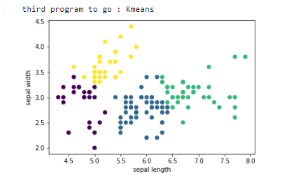

# project idea
le projet represent une analyse des données de la base de données Iris en utilisant de différents algorithmes de classification et de visualisation en PYTHON:
<h2>le résultat s'affiche comme suit: </h2>

<h3>ACP: </h3>

<h3>ANOVA: </h3>

<h3>CAH: </h3>

<h3>KMEANS: </h3>

<h3>REGRESSION LINEAIRE: </h3>

<h3>REGRESSION LOGISTIQUE: </h3>

